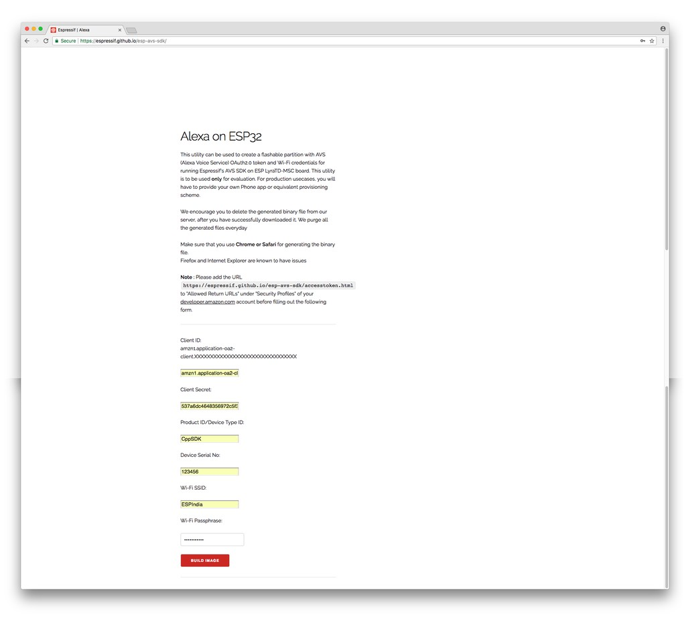
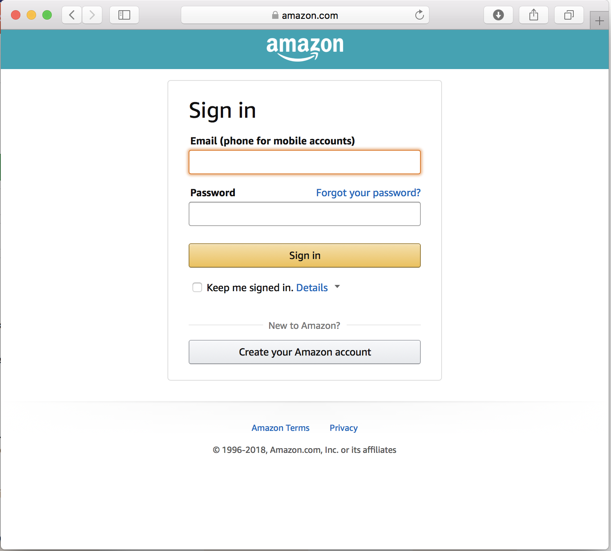
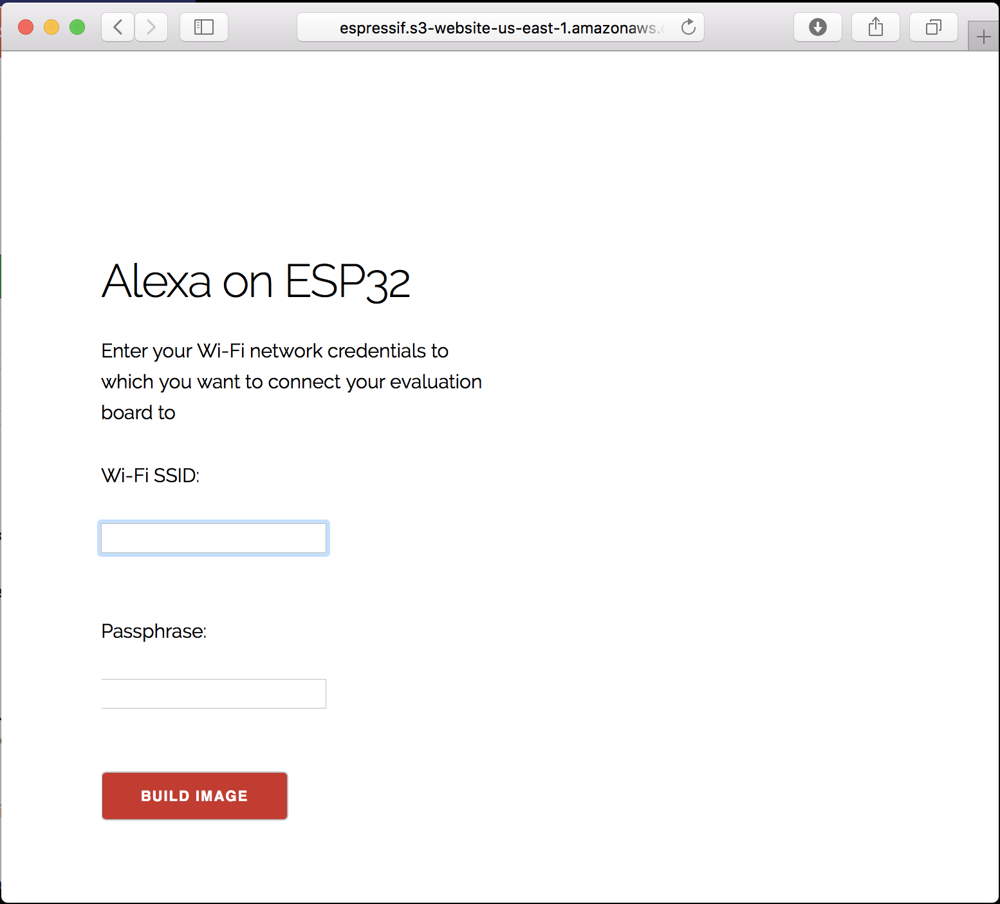
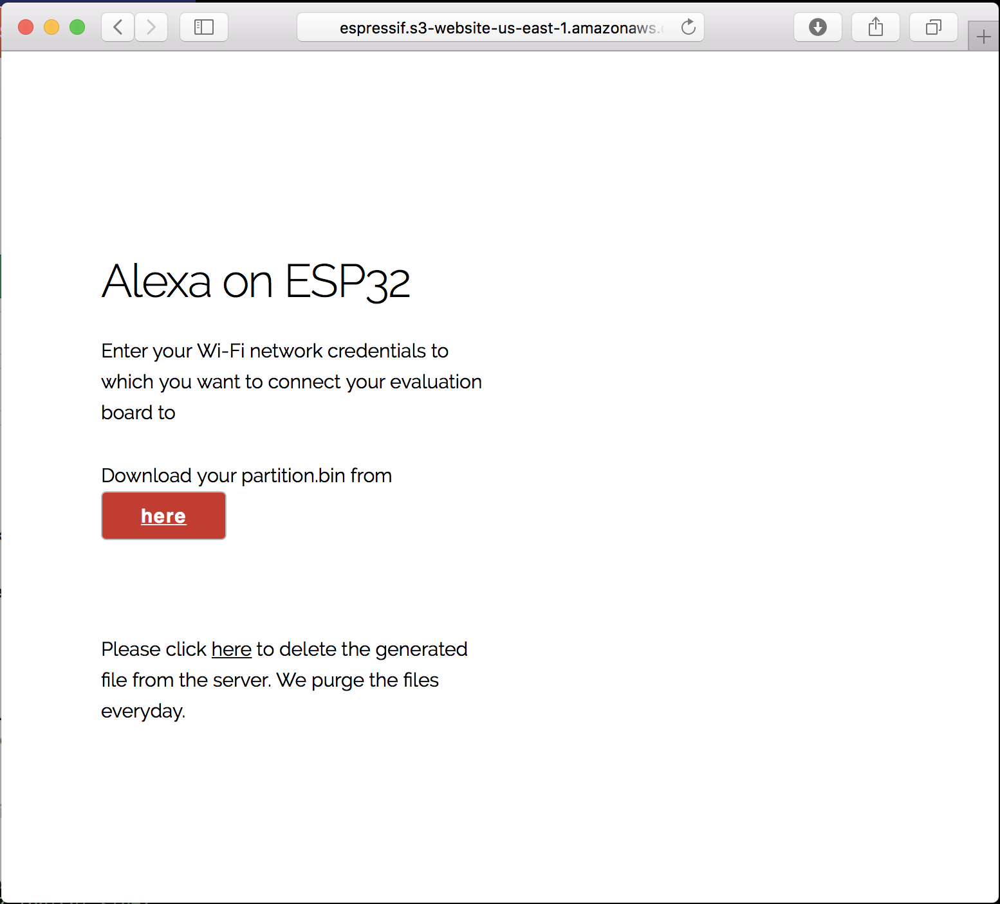
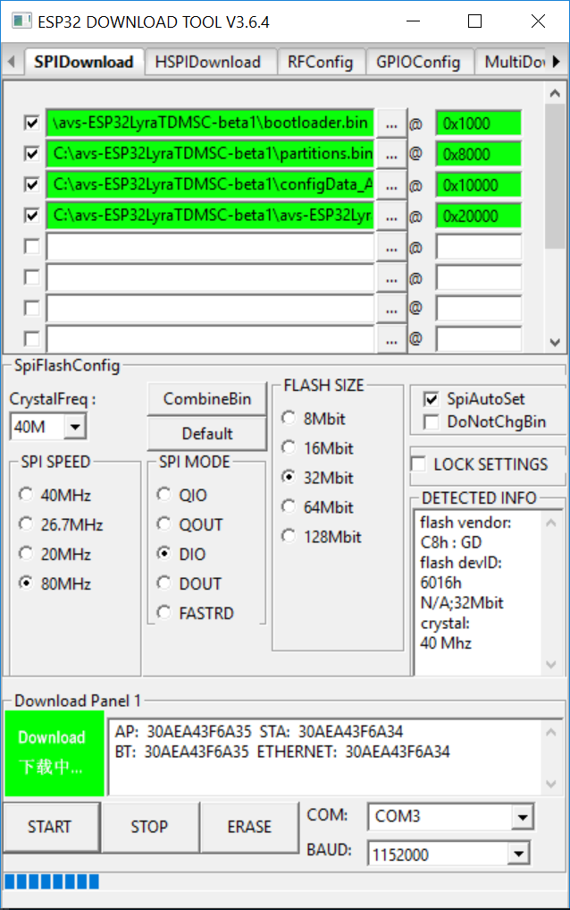
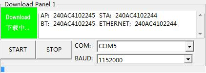

# Overview

The Alexa Voice Service (AVS) enables developers to integrate Alexa directly into their products, bringing the convenience of voice control to any connected device. This repository contains prebuilt binary for trying out AVS on ESP32-LyraTD-MSC board. This is a beta release available for evaluation purposes. The list of known issues is maintained at the bottom of this page.  We will keep updating the release with stability fixes and feature updates regularly.

# Getting Started

## Downloading Firmware

You can download the firmware from this repository's [Release Page](https://github.com/espressif/esp-avs-sdk/releases)

## Device Provisioning

Alexa uses OAuth login to authenticate with Amazon. These credentials need to be stored in the device for communication. The device also needs to be configured to your home Access Point for connecting to the Internet. We have created a simple utility that lets you create a binary blob of this configuration information that can be directly flash into the board. Please follow these steps for the same.

1. Open your browser and visit http://espressif.s3-website-us-east-1.amazonaws.com/. You'll see a page like below.

> Note: Chrome and Safari are tested browsers. Firefox and Internet Explorer are known to have issue.

2. Enter your Amazon credentials in the next page to sign in to your account.
> Note: This app uses OAuth2 protocol to grant the device access to your Amazon account. Espressif or the device does not get your Amazon Sign-in credentials.

3. Enter your WiFi credentials (SSID and Passphrase of an AP you wish to connect your device to) on the next page. And click on "BUILD IMAGE". 
4. The next page will provide a link to download a binary file. This is the configuration data that can be flashed onto your device. Flashing is explained in the next section. 

## Flashing Binaries

Below is the partition table that will be used by the Alexa firmware.

| Binary Files | Address | Function |
| ------------ | ------- | -------- |
| bootloader.bin | 0x1000 | Software bootloader |
| partitions.bin | 0x8000 | Partition table |
| configData\_\<uniqueID\>.bin | 0x10000 | User configuration (Amazon auth token and wifi credentials) |
| esp-alexa.bin | 0x20000 | Application firmware |

### For Windows

* Download ESP32's Flash Download Tool from [here](https://www.espressif.com/en/support/download/other-tools?keys=Flash+Download+Tools). Below is the screenshot of the utility. 
* As shown in the image, use below configuration to setup device for flashing:
- set SPI speed to `40 MHz`
- set `DIO` in `SPI mode`
- select `32 Mbit` for `FLASH SIZE`
- select COM port in line with the one used by the PC
- select `1152000` as a baud rate
- select appropriate paths for each binary as shown in the image above
* Power on ESP32-LytaTD-MSC
* Click `Start` on ESP32 Flash Download Tool to start firmware download.
* Press and hold `Boot` button, and press `RST` button on the board to enter the download mode.
* Wait for download to finish. Below is a screenshot of firmware being downloaded. 

### For Linux/MacOSX

* Clone esp-idf repo from [here](https://github.com/espressif/esp-idf)
* Set the board to UART programming mode by holding "Boot" button and then reset the board using `RST` button while `Boot` is still pressed.
* You can download the config data binary generated in the previous step using esptool.py utility as Below
```
$ python /path/to/esp-idf/components/esptool_py/esptool/esptool.py --chip esp32 --port /dev/<port> --baud 921600 --before default_reset --after hard_reset write_flash -z --flash_mode dio --flash_freq 80m --flash_size detect 0x1000 /path/to/bootloader.bin 0x20000 /path/to/avs-ESP32LyraTDMSC-*.bin 0x8000 /path/to/partitions.bin 0x10000 /path/to/configData_<uniqueID>.bin
```
# Talking to Alexa

* Once images are flashed, boot the device by pressing `RST` button.
* Once the board is connected to your Access Point and subsequently to Alexa, the blue ring will glow once. This indicates that the board is ready to accept commands.
* You can wake the device, to start receiving your query, in couple of ways:
    1. *Wake Word Detection* : You can wake the device by saying `Alexa`. The blue ring will glow to indicate that the board is now listening for your query. Go ahead and ask Alexa your query to Alexa.
    2. *Tap-to-Talk Button* : Press-and-Release the `REC` button on the board to wake the device. The blue ring will glow to indicate that the board is now listening for your query. Go ahead and ask Alexa your query to Alexa.
* You can ask for various things like:
    * tell me joke
    * how is the weather
    * will it rain today
    * sing a song
* Press `Vol+` and `Vol-` buttons on the board to increase and decrease the volume.

# Known issues

* We are working on the wakeword optimization for the keyword 'Alexa'. It is also dependent on the sample-set that is used for training the wakeword detection. Depending upon your accent, it may be likely that the wakeword detection will not work for you. In such a case, please use to Tap-to-Talk button for waking up the board, as indicated in the section above.
* Sometimes the device fails to respond to query and stalls. The blue LED ring stays lit up. The board needs to be reset to continue further.
* For playing music, music sites may provide various forms of playlists to the device. Currently only a basic HTTP redirection (x-mpegurl) is supported. Sites/stations using other forms of redirection such as Playlist files or ICY headers are yet to be supported.
