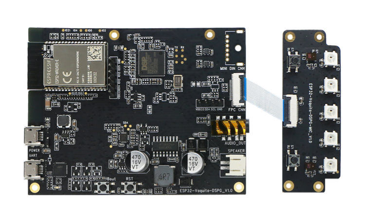
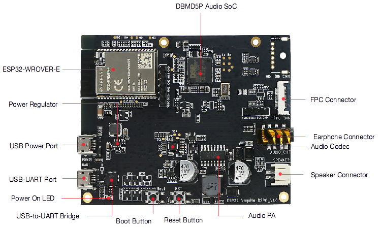
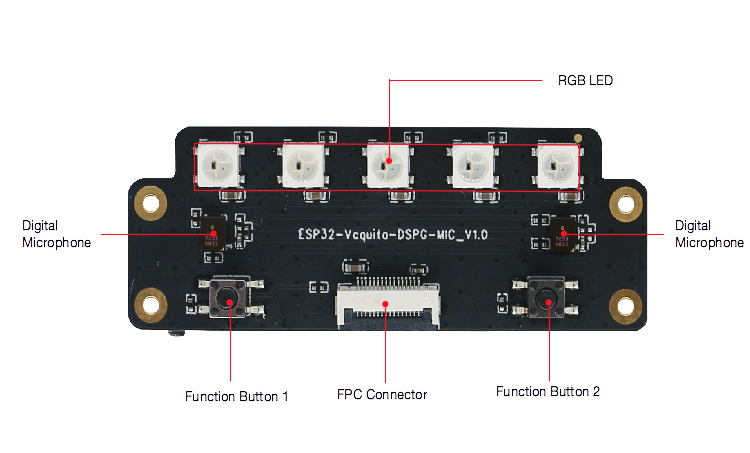
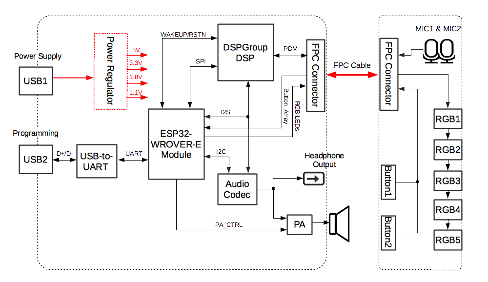

# ESP32-Vaquita-DSPG 用户指南

* [English Version](../../../en/hw-reference/esp32/user-guide-esp32-vaquita-dspg.md)

本指南介绍了乐鑫的开发板 ESP32-Vaquita-DSPG。

ESP32-Vaquita-DSPG 基于亚马逊物联网平台 (AWS IoT) 的 Alexa 语音服务 (AVS) 为用户提供了一站式方案（Turnkey），可以帮助用户轻松构建集成亚马逊 Alexa、具备语音功能、连接 AWS IoT 平台的物联网设备。

ESP32-Vaquita-DSPG

本指南包括如下内容：

* [入门指南](#1-入门指南): 简要介绍了 ESP32-Vaquita-DSPG 和硬件、软件设置指南。
* [硬件参考](#2-硬件参考): 详细介绍了 ESP32-Vaquita-DSPG 的硬件。
* [相关文档](#3-相关文档): 列出了相关文档的链接。

# 1. 入门指南

本节介绍了如何快速上手 ESP32-Vaquita-DSPG。开头部分介绍了 ESP32-Vaquita-DSPG，[开始开发应用](#14-开始开发应用) 小节介绍了怎样在 ESP32-Vaquita-DSPG 上安装模组、设置和烧录固件。

## 1.1 概述

ESP32-Vaquita-DSPG 为用户提供了便捷、安全、高性价比的方式开发语音控制的物联网设备。该款开发板集成了乐鑫的 ESP32 无线 SoC 芯片、DSP 集团的 DBMD5P 音频 SoC 芯片和 360 度拾音的双麦克风阵列，帮助用户轻松开发集成亚马逊 Alexa、具备语音功能、连接 AWS IoT 平台的物联网设备。

## 1.2 内含组件和包装

### 1.2.1 零售订单

如购买样品，每个 ESP32-Vaquita-DSPG 将单独包装，内含：
* ESP32-Vaquita-DSPG 主板
* ESP32-Vaquita-DSPG 子板
* FPC 排线

零售订单请前往 <https://www.espressif.com/zh-hans/company/contact/buy-a-sample>。

### 1.2.2 批量订单

如批量购买，开放版将以大纸板箱包装。

批量订单请参考[乐鑫产品订购信息](https://www.espressif.com/sites/default/files/documentation/espressif_products_ordering_information_cn.pdf) (PDF) 。

## 1.3 组件介绍

ESP32-Vaquita-DSPG 主板正面

ESP32-Vaquita-DSPG 子板正面

|主要组件|介绍|
|:- |:- |
|ESP32-WROVER-E|这款 ESP32 模组内置 ESP32-D0WD-V3 芯片、64 Mbit SPI flash 和 64 Mbit PSRAM，可灵活存储数据，具有 Wi-Fi / BT 连接和数据处理能力。|
|DBMD5P 音频 SoC|这款芯片采用 HDClear™ 算法，具有出色的原厂语音识别性能。|
|电源稳压器|5V 转 3.3V 稳压器。|
|USB 电源接口|为开发板供电。|
|USB 转 UART 接口|电脑和开发板之间的通信接口。|
|电源指示 LED|亮红灯说明开发板已通电。|
|USB 转 UART 桥接器|单芯片 USB-UART 桥接器，可提供高达 3Mbps 的传输速率。|
|Boot 键|下载按键。按住 Boot 键的同时按一下 EN 键进入"固件下载"模式，通过串口下载固件。|
|Reset 键|按住此键使系统复位。 |
|音频功率放大器|放大外接扬声器的音频信号，最大至 8 W。|
|音频编解码器 |音频编解码器 ES8311 通过 I2S 总线将数字信号转换为模拟信号与 ESP32 通信。|
|扬声器连接器| 外接扬声器。|
|耳机连接器|外接耳机。|
|FPC 连接器|连接主板和子板。|
|数字麦克风|两个数字麦克风阵列。|
|RGB LED|五个红绿蓝发光二极管。|
|Function 键|两个功能键。|

## 1.4 开始开发应用

通电前，请确保 ESP32-Vaquita-DSPG 完好无损。

### 1.4.1 必备硬件

* ESP32-Vaquita-DSPG
* 两根 USB 2.0 数据线（标准 A 型转 Micro-B 型）
* 4 欧姆扬声器或耳机
* 电脑（Windows、Linux 或 macOS）

### 1.4.2 硬件设置

1. 使用 FPC 排线连接 ESP32-Vaquita-DSPG 子板和 ESP32-Vaquita-DSPG 主板。
2. 将 4 欧姆扬声器接至扬声器连接器，或将耳机接至耳机连接器。
3. 使用两根 USB 数据线连接电脑与 ESP32-Vaquita-DSPG 的两个 USB 接口。
4. 电源指示 LED 应该亮红灯。

### 1.4.3 软件设置

本款开发板可支持多种应用场景，其中最主要的应用场景是亚马逊物联网平台 (AWS IoT) 的 Alexa 语音服务（Alexa Voice Service，简称 AVS）。您可下载乐鑫的 [ESP AVS for AWS IoT](https://github.com/espressif/esp-va-sdk/tree/feature/aia-beta)，参考[使用指南](https://github.com/espressif/esp-va-sdk/blob/feature/aia-beta/README.md)。

# 2. 硬件参考

## 2.1 功能框图

ESP32-Vaquita-DSPG 的主要组件和连接方式如下图所示。

ESP32-Vaquita-DSPG 功能框图

# 3. 相关文档

* [ESP32-Vaquita-DSPG 主板原理图](https://dl.espressif.com/dl/schematics/ESP32-VAQUITA-DSPG_V1.0_schematics.pdf) (PDF)
* [ESP32-Vaquita-DSPG 子板原理图](https://dl.espressif.com/dl/schematics/ESP32-VAQUITA-DSPG-MIC_V1.0_schematics.pdf) (PDF)
* [ESP32-Vaquita-DSPG 主板 PCB 布局](https://dl.espressif.com/dl/schematics/ESP32-Vaquita-DSPG_V1.0_PCB_Layout.pdf) (PDF)
* [ESP32-Vaquita-DSPG 子板 PCB 布局](https://dl.espressif.com/dl/schematics/ESP32-Vaquita-DSPG-MIC_V1.0_PCB_Layout.pdf) (PDF)
* [ESP32-WROVER-E & ESP32-WROVER-IE 技术规格书](https://www.espressif.com/sites/default/files/documentation/esp32-wrover-e_esp32-wrover-ie_datasheet_cn.pdf) (PDF)
* [ESP32 技术规格书](https://www.espressif.com/sites/default/files/documentation/esp32_datasheet_cn.pdf) (PDF)
* [乐鑫产品订购信息](https://www.espressif.com/sites/default/files/documentation/espressif_products_ordering_information_cn.pdf)  (PDF)
